# HybridDesign Workbench

Custom FreeCAD Workbench for advanced modeling and OCCT-powered geometry creation. It was inspired by the capabilities of the CATIA V5 GSD Workbench.
Since CATIA has a well-known and established surfacing workflow, it might (or might not) be a good idea, to bring some of those features into FreeCAD.

## Overview

This workbench extends FreeCAD with the following features:

- AutoFillet
- Boundary
- CutSolid
- Defeature (Parametric)
- Surface Extrusion
- Extract

---

## Features

### AutoFillet

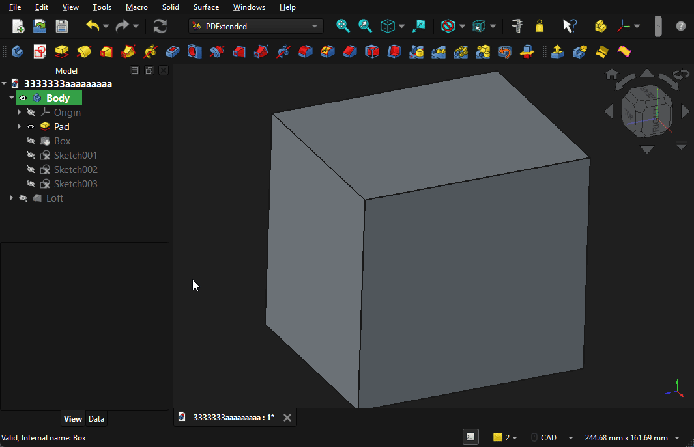

Enables users to create fillets based on the previous feature in a PDBody.
The edges to be filleted are selected according to the `FilterType` property.

Support for non-straight edges (e.g. arcs, B-splines) is still a work in progress.

#### Example Workflow

1. Add a snap-fit clip using a boolean operation.
2. Launch the command.
3. Choose the `Intersection` FilterType.
4. The edges at the intersection of the new snap-fit feature and the base feature are filleted.

---

### Defeature (Parametric)

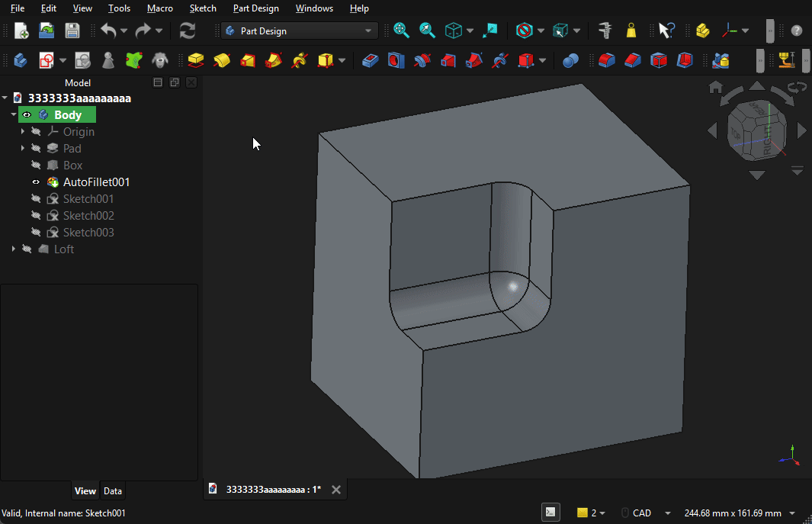

Implements the Part Defeature command within the PartDesign workflow (inside a Body) and makes it parametric.

#### Benefits

- Integrated into PDBody
- Full parametric control

---

### Extrusion

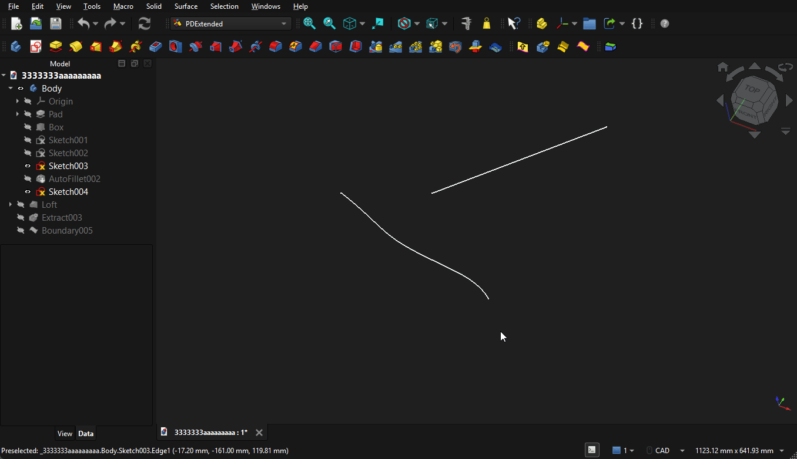

An implementation of `Part::Extrude`. Still a work in progress.

#### Supported Inputs

- Sketches
- Wires
- Edges

---

### Extract

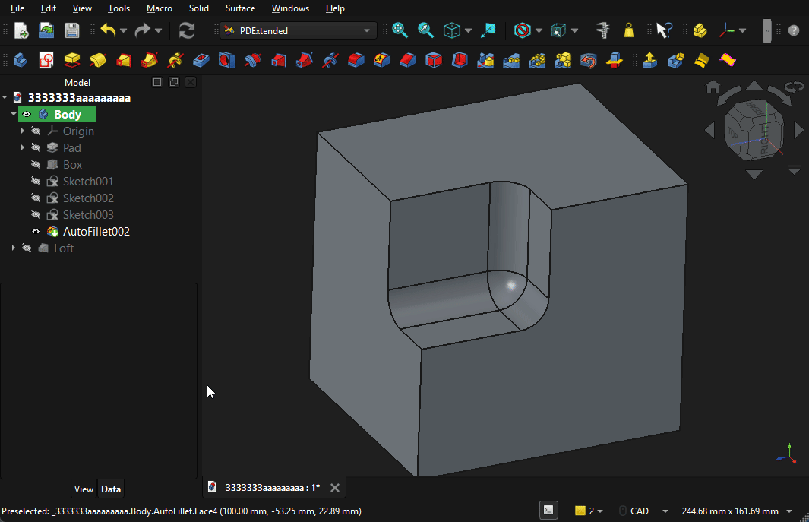

Implements surface extraction (single-face or multi-face) with filtering options.

The tangency filter is probably the most promising feature.

#### Supported Inputs

- Faces/Surfaces
- Tree View surface/face containers

---

### CutSolid

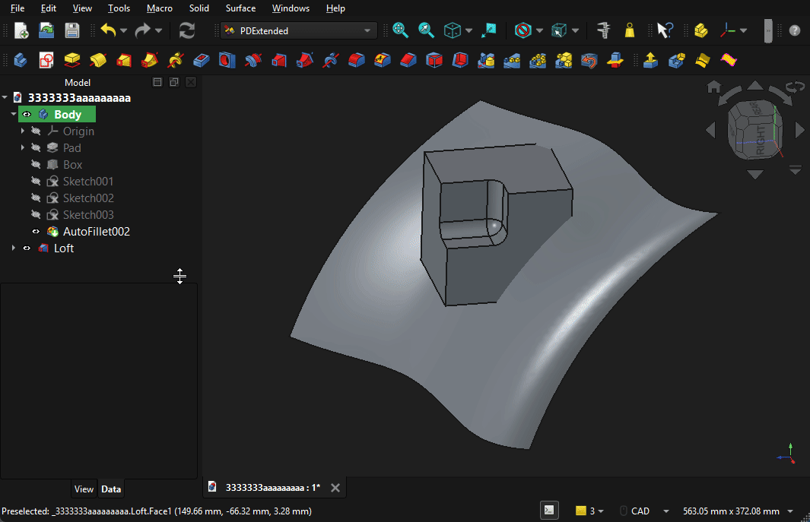

Implements cutting a PDBody using surface objects.

#### Supported Inputs

- Faces/Surfaces

---

### OffsetSurface

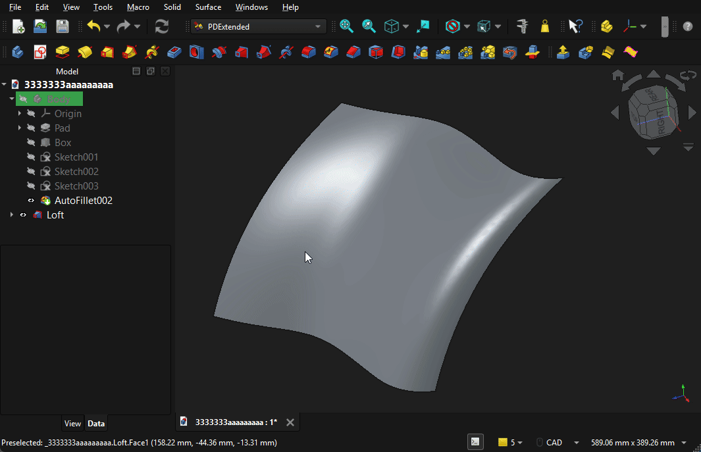

Implementation of the Part Offset tool.

#### Supported Inputs

- Faces/Surfaces

---

### Boundary

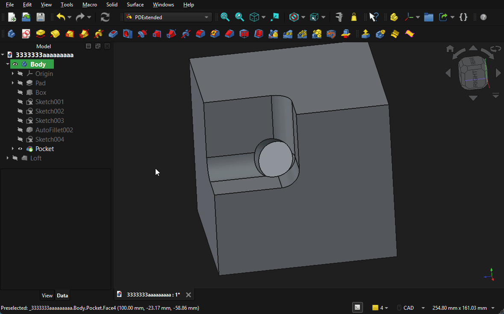

Extracts outer wires, inner wires, or any boundary wire in between.

#### Supported Inputs

- Faces/Surfaces

---

### TangentSelection

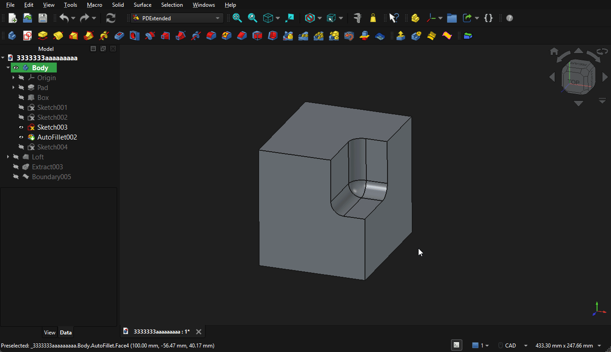

Propagates selection onto faces tangent to the seed face, until sharp corrner.

#### Supported Inputs

- Faces/Surfaces

---

### EnclosedSelection

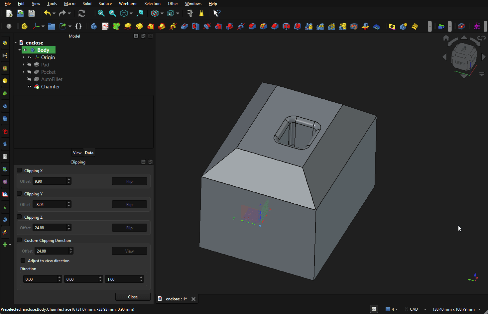

Propagates selection onto faces based on seed face until it encounters boundary faces.

#### Supported Inputs

- Faces/Surfaces

---

### ThickenSurface

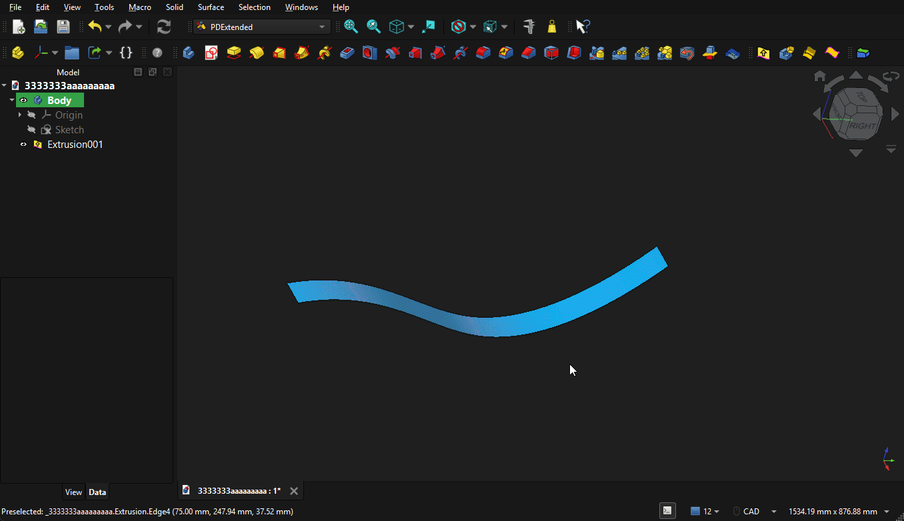

Creates solid by offseting surface.

#### Supported Inputs

- Faces/Surfaces

---

### SplitSurface

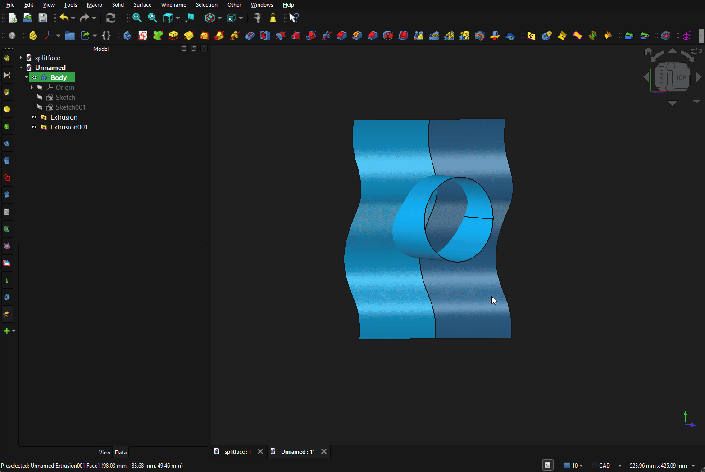

Cuts first selected surface with second as cutting tool.

#### Supported Inputs

- Faces/Surfaces
---

### ShapeFillet

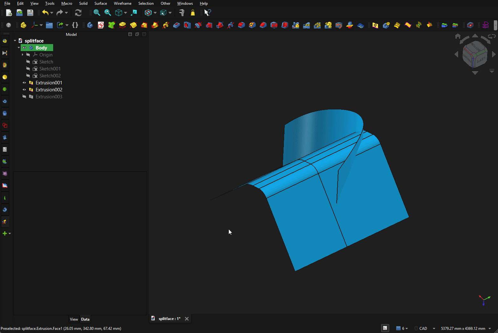

Creates fillet betwen surfaces based on intersection.
WIP! Surfaces have to idealy intersect !

#### Supported Inputs

- Faces/Surfaces

### CurvedHelix

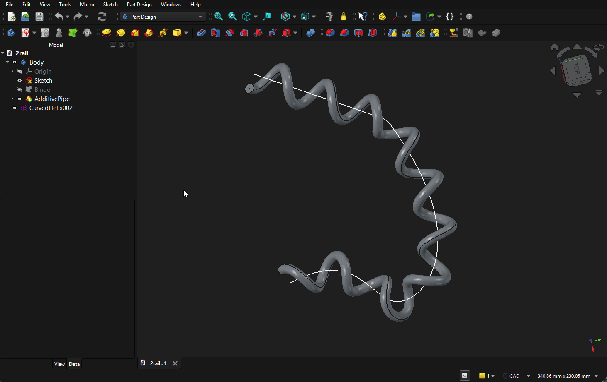

Creates curved helix along the spine.

#### Supported Inputs

- Wires/Sketches
