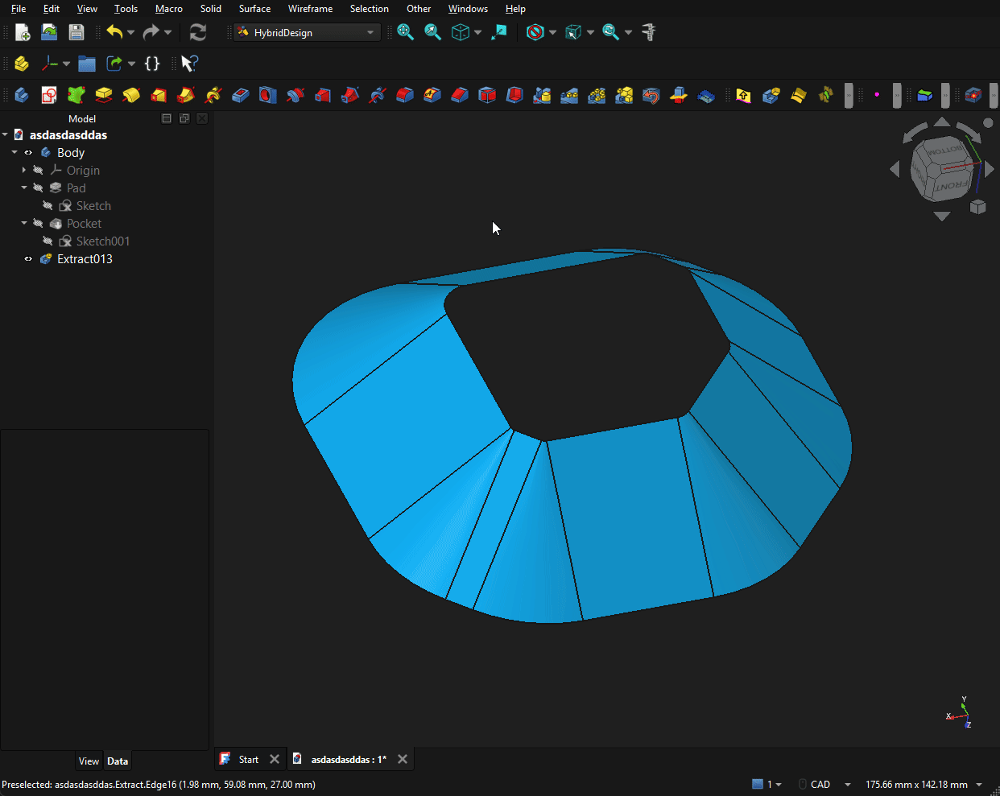

# HybridDesign Workbench

Custom FreeCAD Workbench for advanced modeling and OCCT-powered geometry creation. It was inspired by the capabilities of the CATIA V5 GSD Workbench.
Since CATIA has a well-known and established surfacing workflow, it might (or might not) be a good idea, to bring some of those features into FreeCAD.
WB is in Alpha stage.

# Installation

Since WB is in Alpha stage, its not present in FreeCAD AddonManager.
For there are two ways to install HybridDesign.

## Manual

1. Clone repo (main or dev branch)
2. Put cloned repo in your Mod folder. usualy <code>C:\Users\\$USER\AppData\Roaming\FreeCAD\Mod</code> - Windows. <code>~/.local/share/FreeCAD/Mod</code> - Linux

## Semi-automatic

1. Copy repo url
2. In FreeCAD go to <code>Edit->Preferences->Addon Manager->Addon Manager Options</code>
3. Add repo url to <code>Custom repositories</code> section.
4. HybridDesign should be now visible and ready to be installed in AddonManger.

# Docs

For examples and basic how to, check [docs](/docs.md)

